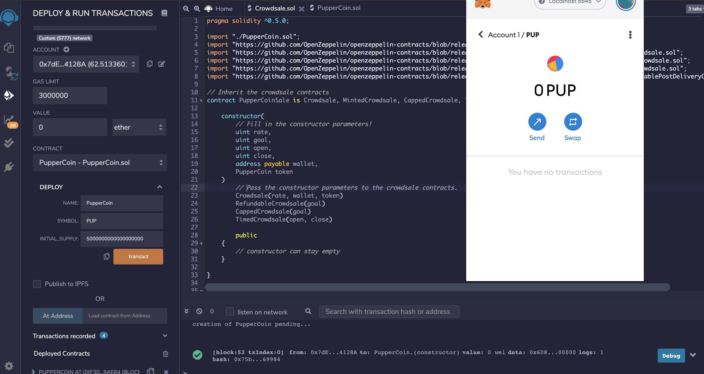

# Creating PupperCoin Token via Solidity

Your company has decided to crowdsale their PupperCoin token in order to help fund the network development.
This network will be used to track the dog breeding activity across the globe in a decentralized way, and allow humans to track the genetic trail of their pets. You have already worked with the necessary legal bodies and have the green light on creating a crowdsale open to the public. However, you are required to enable refunds if the crowdsale is successful and the goal is met, and you are only allowed to raise a maximum of 300 Ether. The crowdsale will run for 24 weeks.

This crowdsale contract will manage the entire process, allowing users to send ETH and get back PUP (PupperCoin).
This contract will mint the tokens automatically and distribute them to buyers in one transaction.

#### PupperCoinCrowdsale

- `RefundablePostDeliveryCrowdsale` inherits the `RefundableCrowdsale` contract, which requires a `goal` parameter.
- Call the `RefundableCrowdsale` constructor from the `PupperCoinCrowdsale` constructor as well as the others.
- `RefundablePostDeliveryCrowdsale` does not have its own constructor and thus use the `RefundableCrowdsale` constructor that it inherits.
- Pass the `open` and `close` times by using `now` and `now + 24 weeks` to set the times properly from `PupperCoinCrowdsaleDeployer` contract.

### Deploying the Crowdsale

